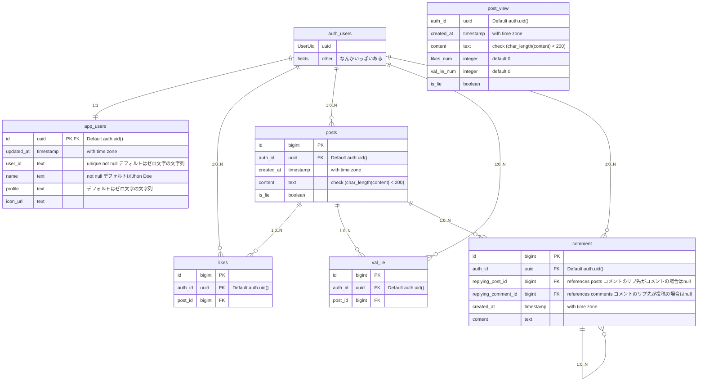

# ER図
- 現在実装しているスキーマ



- 検討したが継承は今回やるにはクエリがややこしいので破棄したスキーマ(スキーマ上では簡潔)


投稿，コメントを総括するテーブルがあり，isA関係によって投稿とコメントに分けられる．

posts < fake_posts, commentsに分ける
## 各テーブルの説明

- auth_user: supabaseがもつauth.usersのこと uuid,Email,passeordといった認証に必要な情報を持つ このテーブルを中心として構成されている
- app_user: アプリケーションがもつユーザー情報 ユーザ名，ユーザが設定可能なユーザID，プロフィール，アイコン画像など
- posts: 投稿の情報を持つテーブル 新たに投稿を作成する際はこのテーブルにレコードを追加するが，データを取得する際はpost_viewを用いる
- likes: いいねの情報を持つテーブル だれがどの投稿にいいねしたかを持つ．
- val_lie: だまされたの情報を持つテーブル だれがどの投稿にだまされたを付けたかを持つ．
- post_view: 投稿の情報を持つテーブル postsテーブルと，そのレコードに紐づくlikesテーブル，val_lieテーブルのレコードの数をそれぞれ数えたビュー ようするにいいね数とだまされた数を持つ
- comment: コメントの情報を持つテーブル 投稿に対するコメント，コメントに対するコメントをを表現可能．replying_post_id, replying_comment_idのどちらか片方はnullにして対応する．

## sqlの参考元
```sql
-- Create a table for Public Profiles
create table profiles (
  id uuid references auth.users not null,
  updated_at timestamp with time zone,
  username text unique,
  avatar_url text,
  website text,

  primary key (id),
  unique(username),
  constraint username_length check (char_length(username) >= 3)
);

alter table profiles enable row level security;

create policy "Public profiles are viewable by everyone."
  on profiles for select
  using ( true );

create policy "Users can insert their own profile."
  on profiles for insert
  with check ( auth.uid() = id );

create policy "Users can update own profile."
  on profiles for update
  using ( auth.uid() = id );

-- Set up Realtime!
begin;
  drop publication if exists supabase_realtime;
  create publication supabase_realtime;
commit;
alter publication supabase_realtime add table profiles;

-- Set up Storage!
insert into storage.buckets (id, name)
values ('avatars', 'avatars');

create policy "Avatar images are publicly accessible."
  on storage.objects for select
  using ( bucket_id = 'avatars' );

create policy "Anyone can upload an avatar."
  on storage.objects for insert
  with check ( bucket_id = 'avatars' );
```

```sql
create table todos (
  id bigint generated by default as identity primary key,
  user_id uuid references auth.users not null,
  task text check (char_length(task) > 3),
  is_complete boolean default false,
  inserted_at timestamp with time zone default timezone('utc'::text, now()) not null
);

alter table todos enable row level security;

create policy "Individuals can create todos." on todos for
    insert with check (auth.uid() = user_id);

create policy "Individuals can view their own todos. " on todos for
    select using (auth.uid() = user_id);

create policy "Individuals can update their own todos." on todos for
    update using (auth.uid() = user_id);

create policy "Individuals can delete their own todos." on todos for
    delete using (auth.uid() = user_id);
```

# 作成したsql
### app_users
```sql

create table app_users (
    id uuid references auth.users default auth.uid() not null,
    updated_at timestamp with time zone,
    user_id text unique default auth.uid() not null,
    name text not null,
    profile text,
    icon_url text,

    primary key (id),
    unique(user_id)

);

alter table app_users enable row level security;

create policy "Public app_users are viewable by everyone."
    on app_users for select
    using ( true );

create policy "Users can insert their own app_users."
    on app_users for insert
    with check ( auth.uid() = id );

create policy "Users can update own app_users."
    on app_users for update
    using ( auth.uid() = id );

-- Set up Realtime!
begin;
    drop publication if exists supabase_realtime;
    create publication supabase_realtime;
commit;
alter publication supabase_realtime add table app_users;

-- Set up Storage!
insert into storage.buckets (id, name)
values ('icons', 'icons');

create policy "Avatar images are publicly accessible."
    on storage.objects for select
    using ( bucket_id = 'icons' );

create policy "Anyone can upload an icon."
    on storage.objects for insert
    with check ( bucket_id = 'icons' );

-- トリガーとファンクションの設定
/**
 * Supabase Authでサインアップしたら自動でユーザーを作成するためのトリガー
 */
-- inserts a row into public.profiles
create function public.handle_new_user()
returns trigger
language plpgsql
security definer set search_path = public
as $$
begin
  insert into public.app_users (id)
  values (new.id);
  return new;
end;
$$;

-- trigger the function every time a user is created
create trigger on_auth_user_created
  after insert on auth.users
  for each row execute procedure public.handle_new_user();


```
### bingAIの解説
```
このSQL文は、SupabaseのRealtimeとStorage機能を設定するためのものです。

まず、Realtime機能の設定を行います。`begin;`から`commit;`までの部分がトランザクションです。`drop publication if exists supabase_realtime;`は、既に存在する場合は`supabase_realtime`という名前のパブリケーションを削除します。次に、`create publication supabase_realtime;`で、新しいパブリケーションを作成します。最後に、`alter publication supabase_realtime add table profiles;`で、`profiles`テーブルをパブリケーションに追加します。

次に、Storage機能の設定を行います。まず、`insert into storage.buckets (id, name) values ('avatars', 'avatars');`で、新しいバケットを作成します。このバケットは、アバター画像を保存するためのものです。

次に、2つのポリシーを作成します。1つ目のポリシーは、「Avatar images are publicly accessible.」という名前で、`storage.objects`テーブルに対して適用されます。このポリシーは、選択操作に対して適用されます。条件として、`bucket_id = 'avatars'`が指定されています。つまり、このポリシーは、「avatars」バケット内のオブジェクトが公開されることを意味します。

2つ目のポリシーは、「Anyone can upload an avatar.」という名前で、同じく`storage.objects`テーブルに対して適用されます。このポリシーは、挿入操作に対して適用されます。条件として、`bucket_id = 'avatars'`が指定されています。つまり、このポリシーは、「avatars」バケット内に誰でもオブジェクトをアップロードできることを意味します。

以上が、このSQL文の解説です。

ソース: Bing との会話 2023/8/14
(1) GitHub - supabase/realtime: Broadcast, Presence, and .... https://github.com/supabase/realtime.
(2) Realtime | Supabase Docs. https://supabase.com/docs/guides/realtime.
(3) Storage | Store any digital content - Supabase. https://supabase.com/storage.
(4) Storage | Supabase Docs. https://supabase.com/docs/guides/storage.
(5) 【Flutter】Supabase Storageの使い方 - Zenn. https://zenn.dev/dk96424/articles/d7efb641e01445.
(6) Storage Quickstart | Supabase Docs. https://supabase.com/docs/guides/storage/quickstart.
(7) undefined. https://hub.docker.com/r/supabase/realtime.
(8) undefined. https://github.com/supabase/realtime/tree/main/demo.
```

SupabaseのRealtimeとStorage機能について教えてください。
```
Supabaseは、RealtimeとStorageという2つの機能を提供しています。

Realtime機能は、データベースの変更をリアルタイムで同期することができる機能です¹。Supabaseは、世界中に分散されたRealtimeサーバークラスターを提供しており、以下のような機能が利用できます²。
- Broadcast: クライアント間で低遅延の一時的なメッセージを送信することができます。
- Presence: クライアント間で共有状態を追跡および同期することができます。
- Postgres Changes: Postgresデータベースの変更をリッスンし、認証されたクライアントに送信することができます。

Storage機能は、デジタルコンテンツを保存および配信するための機能です⁵。Supabase Storageは、無制限のスケーラビリティを持つオープンソースのオブジェクトストアであり、任意のファイルタイプに対応しています。カスタムポリシーやパーミッションも簡単に実装することができます。

Supabase Storageは、AuthやPostgresなどのSupabaseエコシステムともよく統合されており、高速かつ薄いAPIサーバーレイヤーにより、Postgresのパーミッションとパフォーマンスを活用しています。また、メディア管理用のスリークなダッシュボードも提供されており、ドラッグアンドドロップによるアップロードやオブジェクト移動、複数オブジェクト選択などが簡単に行えます。

以上が、SupabaseのRealtimeとStorage機能についての説明です。詳しい情報はSupabaseの公式ドキュメント²⁶を参照してください。

ソース: Bing との会話 2023/8/14
(1) Realtime | Sync your data in real time - Supabase. https://supabase.com/realtime.
(2) Realtime | Supabase Docs. https://supabase.com/docs/guides/realtime.
(3) Storage | Store any digital content - Supabase. https://supabase.com/storage.
(4) Storage | Supabase Docs. https://supabase.com/docs/guides/storage.
(5) GitHub - supabase/realtime: Broadcast, Presence, and .... https://github.com/supabase/realtime.
(6) Realtime | Supabase. https://supabase.com/docs/guides/realtime/overview.
(7) Storage Quickstart | Supabase Docs. https://supabase.com/docs/guides/storage/quickstart.
```

### 投稿テーブル
```sql
create table posts (
  id bigint generated by default as identity, 
  auth_id uuid references auth.users default auth.uid() not null,
  created_at timestamp with time zone,
  content text check (char_length(content) < 200),
  is_lie boolean,

  primary key (id)
);

--  default timezone('utc'::text, now()) not null これなんぞ
-- is_lieは、嘘かどうかを判定するためのフラグです。嘘の場合はtrue、本当の場合はfalseです。
-- 変更する可能性が非常に大きい，嘘かどうかの2値だけではなくパラメータを格納すると思う

alter table posts enable row level security;

create policy "Individuals can create posts." on 
posts for
    insert with check (auth.uid() = auth_id);

create policy "Public posts are viewable by everyone." on posts for
    select using (true);

create policy "Individuals can update their own posts." on posts for
    update using (auth.uid() = auth_id);

create policy "Individuals can delete their own posts." on posts for
    delete using (auth.uid() = auth_id);

```

### いいねテーブル
```sql
create table likes (
  id bigint generated by default as identity, 
  auth_id uuid references auth.users default auth.uid() not null,
  post_id bigint references posts not null,

  primary key (id)
);

alter table likes enable row level security;

create policy "Public likes are viewable by everyone." on likes for
    select using (true);

create policy "Individuals can create likes." on 
likes for
    insert with check (auth.uid() = auth_id);

create policy "Individuals can update their own likes." on likes for
    update using (auth.uid() = auth_id);

create policy "Individuals can delete their own likes." on likes for
    delete using (auth.uid() = auth_id);

```

### だまされたテーブル
```sql
create table val_lies (
  id bigint generated by default as identity, 
  auth_id uuid references auth.users default auth.uid() not null,
  post_id bigint references posts not null,

  primary key (id)
);

alter table val_lies enable row level security;

create policy "Public val_lies are viewable by everyone." on val_lies for
    select using (true);

create policy "Individuals can create val_lies." on
val_lies for
    insert with check (auth.uid() = auth_id);

create policy "Individuals can update their own val_lies." on val_lies for
    update using (auth.uid() = auth_id);

create policy "Individuals can delete their own val_lies." on val_lies for
    delete using (auth.uid() = auth_id);

```

### 投稿のビュー

```sql
-- postIDが一致するいいねの数を数える
-- postIDが一致するだまされた数を数える

create view post_view as
select
  posts.id,
  posts.auth_id,
  posts.created_at,
  posts.content,
  posts.is_lie,
  count(likes.post_id) as likes_num,
  count(val_lies.post_id) as val_lie_num
from posts
left join likes on posts.id = likes.post_id
left join val_lies on posts.id = val_lies.post_id
group by posts.id;
```

### コメントテーブル
```sql
create table comments (
  id bigint generated by default as identity, 
  replying_post_id bigint references posts,
  replying_comment_id bigint references comments,
  auth_id uuid references auth.users default auth.uid() not null,
  content text,
  created_at timestamp with time zone,

  primary key (id)
);

alter table comments enable row level security;

create policy "Public comments are viewable by everyone." on 
comments for
    select using (true);

create policy "Individuals can create comments." on 
comments for
    insert with check (auth.uid() = auth_id);

create policy "Individuals can update their own comments." on 
comments for
    update using (auth.uid() = auth_id);

create policy "Individuals can delete their own comments." on 
comments for
    delete using (auth.uid() = auth_id);

```
